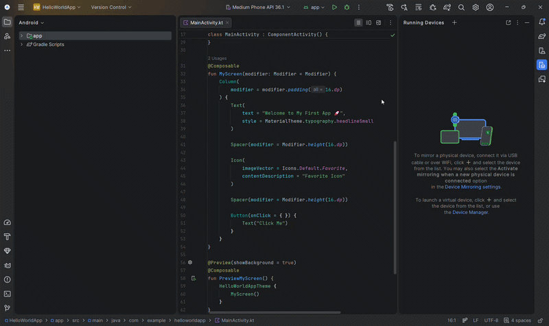

# 📱 Hello-World-App

Welcome to my first Android application! This project marks the beginning of my journey into mobile development, focusing on UI/UX and hardware integration.

---

<p align="center">
  
  <br>
  <i>Live preview of the Hello World app showing real-time clock and battery status.</i>
</p>

## 📝 Description
This is a sleek frontend application built using **Android Studio**. The app serves as a dynamic "Hello World" project that goes beyond static text by interacting with your device's system data.

### ✨ Key Features
* **Dynamic Greeting:** Displays a "Hello" message upon launching.
* **Real-time Clock:** Shows the current system time accurately.
* **Battery Monitor:** Displays the real-time battery percentage of the device.
* **Hybrid Codebase:** Built using a mix of modern and industry-standard languages.

---

## 🛠 Tech Stack & Languages
* **Kotlin** 🚀 (Primary Logic)
* **Java** ☕ (Supporting Logic)
* **XML** 🎨 (UI/Layout Design)
* **Android SDK** 🤖

---

## 🚀 How to Download & Run

Follow these steps to get a copy of the project up and running on your local machine using **Android Studio**.

### 1. Prerequisites
Ensure you have the latest version of [Android Studio](https://developer.android.com/studio) installed.

### 2. Clone the Repository
Open your terminal or command prompt and run:
```bash
git clone [https://github.com/YOUR_USERNAME/Hello-World-App.git](https://github.com/YOUR_USERNAME/Hello-World-App.git)

### 🦾 **Screenshots**


